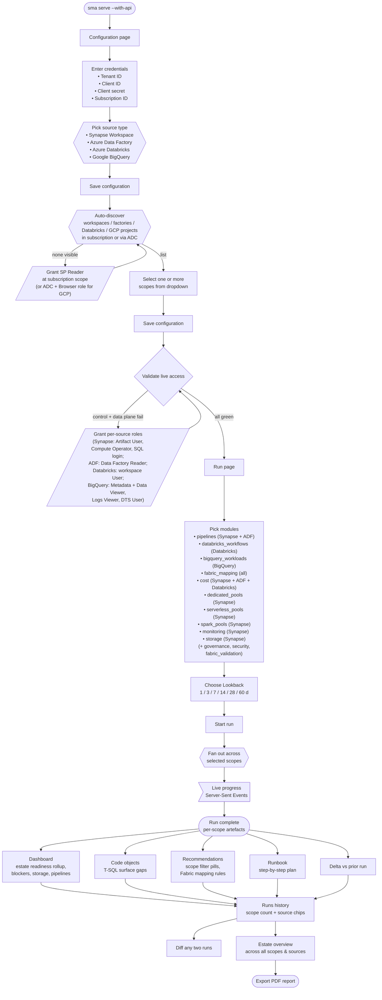

# 01. Getting started

This chapter takes you from "fresh checkout" to "browser pointed at a
live UI" in the shortest path. For the canonical step-by-step (with
service-principal setup) see [QUICKSTART.md](../../QUICKSTART.md).

## Process overview

End-to-end flow through the browser UI, from first launch to a
shareable migration report:



The Configuration step is fully discoverable — only Tenant, Client,
Secret, and Subscription are required input; the resource group and
workspace name are populated from the dropdown.

## The fast path (Windows)

```powershell
.\quickstart.ps1
```

That single line:

1. Clones the repo (skipped if already cloned).
2. Creates `.venv` and installs **all** optional pip extras
   (`dev`, `cost`, `web`).
3. Builds the React SPA bundle into `web/dist/`.
4. Runs `sma doctor --offline` as a smoke test.
5. On success, launches `sma serve --with-api --static-dir web\dist`
   in the foreground (Ctrl+C to stop).

When step 5 finishes, the browser UI is reachable at
<http://127.0.0.1:8000/>.

Useful switches:

- `-Repo Private` — clone the internal fork.
- `-SkipWebBuild` — CLI-only host, no Node.js / npm needed.
- `-NoServe` — finish bootstrapping without launching the server.
- `-SkipDoctor` — skip the offline smoke test.

## The first run

If you launched with `-NoServe`, or you want to start the server
manually, run:

```powershell
sma serve --with-api
# add --port 8001 / --static-dir web\dist if needed
```

Then in the browser:

1. Open the **Configuration** tab and fill in tenant / subscription /
   client ID / workspace name. Paste the client secret in the password
   field. Click **Save**, then **Validate** to confirm the analyzer
   can reach Azure with the credentials. (See
   [12. Configuration](12-configuration.md) for field-by-field details.)
2. Open the **Run** tab. The default module checklist matches
   `sma analyze-all`. Optionally pick a label (free text, lets you
   recognise the run in history later). Click **Start run**.
3. Watch the live progress list under the form. Each module gets one
   row that updates as the run proceeds (`running` → `ok` / `failed`).
4. When the run finishes, the run id is auto-selected and persisted in
   the URL hash. Click **Dashboard** in the top nav — the headline
   stats refresh against the new run.

## What if there is no API server?

If you only have an `output/` folder (static deliverable mode), drop
the bundled SPA next to it and serve the directory:

```powershell
# either from a fresh analysis run …
sma analyze-all --with-webui

# … or copy the bundle manually
Copy-Item -Recurse web\dist output\webui

# Then serve
sma serve --output-dir output
```

The browser opens `output/webui/index.html`. The static SPA shows the
five read-only pages: Dashboard, Code objects, Recommendations,
Runbook, Delta. There is no run picker — the SPA reads
`./<module>.json` directly out of the directory it was served from.

See [02. Static vs. control-plane mode](02-modes.md) if you are not
sure which surface you have.

## Where to next

- New analysts: read the [Dashboard chapter](04-dashboard.md), then
  hop to whichever module page is most relevant
  ([Recommendations](06-recommendations.md) for triage,
  [Code objects](05-code-objects.md) for T-SQL deep-dives,
  [Runbook](07-runbook.md) for sequencing).
- Operators running multiple workspaces: read
  [10. Runs (history)](10-runs-history.md) and
  [11. Diff](11-diff-page.md) — those two pages are how you track
  remediation progress over time.
- Anything blocking you: jump to
  [13. Troubleshooting](13-troubleshooting.md).
